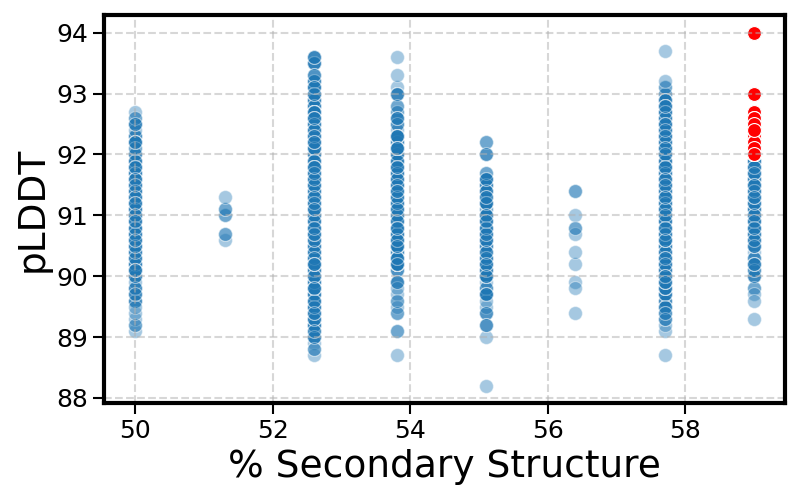
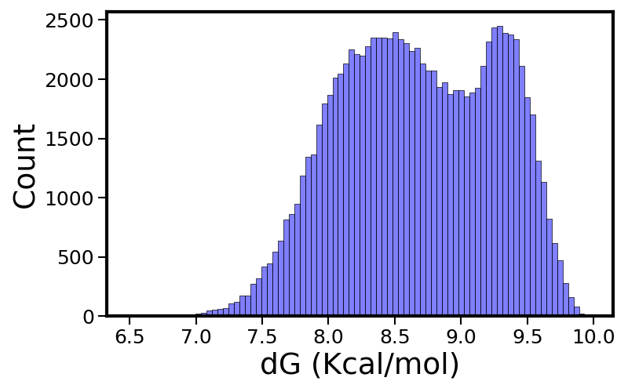
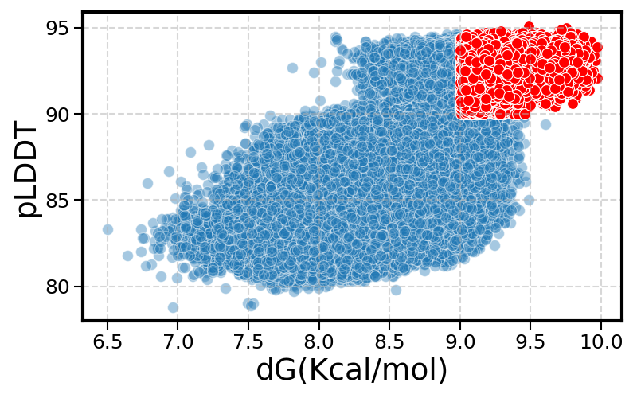

# Spy_Tag_Spy_Catcher
[◈ SpyTag–SpyCatcher · SDC\_155746](#top)

[Objective](#objective) [Pipeline](#pipeline) [Methods](#methods) [Results](#results) [Data](#data)

De novo protein design · SDC\_155746 scaffold

Building a SpyCatcher–SpyTag  
interface onto SDC\_155746
=========================================================
Redesigning the SDC\_155746 scaffold with inverse-folding sequence design to install a strong, orthogonal SpyTag/SpyCatcher-compatible binding surface — enabling site-specific, covalent conjugation of the scaffold.

[See the pipeline ↓](#pipeline) [View results](#results)

The goal

Why put a SpyTag/SpyCatcher on a scaffold?
------------------------------------------

The SpyCatcher–SpyTag system is one of the strongest, most orthogonal non-covalent protein–protein interactions known — a transglutaminase-based pair that forms a stable isopeptide bond (reported Kd ~ 10⁻¹⁷ M). Presenting one half of this pair on a protein scaffold lets that scaffold be conjugated to a partner of choice in a clean, site-specific way.

### 🧬 Scaffold

The SDC\_155746 scaffold (≈78 aa), used as the structural backbone that the new interface is designed around.

### 🎯 Strategy

Hold the target binding-interface residues fixed on the backbone, then **inverse-fold** the surrounding sequence to make the design both well-structured and stable.

### ✅ Selection

Every design is scored on **fold quality** (ESMFold pLDDT/pTM) and **stability** (ESM3dG ΔG) so candidates that both fold cleanly and are thermodynamically stable advance.

Workflow

A three-round design–predict–select loop
----------------------------------------

Start small to validate the strategy, scale to 100k candidates to find the best designs, then finish the leading candidate.

Round 1 · Pilot

10,000 designs

### Validate the approach

*   MPNN inverse folding on `SDC_155746_trunc`
*   ESMFold structure prediction → pLDDT & pTM
*   Secondary-structure analysis per design

**45** designs passed the pLDDT ≥ 92 & ≥58% structured filter

Round 2 · Scale

100,000 designs

### Find the best designs

*   ESMFold prediction for the target structure
*   MPNN with **10 interface positions fixed**
*   ESMFold (pLDDT/pTM) + ESM3dG 3-model ΔG ensemble

**31,209** designs passed pLDDT ≥ 90 & ΔG ≥ 9.0 kcal/mol

Round 3 · Final

Leading candidate

### Finish the pick

*   Take the leading Round-2 sequence
*   ESMFold prediction on the final design
*   Save the predicted structure for downstream use

Final `design_fold` structure generated

Toolbox

Methods & models
----------------

A design→predict→score pipeline built on open structure and design models.

MPNN inverse folding

Message-passing neural network that designs amino-acid sequences on a fixed backbone (dauparas et al., 2022). Used to generate every candidate in Rounds 1–2.

→ sequence design (all rounds)

ESMFold

Structure prediction used throughout the project: it provides the Round-2 target structure and reports per-design **pLDDT** (local confidence) and **pTM** (global confidence) as the primary fold-quality metric.

→ target structure + pLDDT & pTM (Rounds 1–3)

ESM3dG (ensemble)

Fold-stability prediction of ΔG (kcal/mol). Run as a **3-checkpoint LoRA ensemble** and aggregated to a mean ± std per design for a robust stability score.

→ ΔG stability (Round 2)

Outcomes

What the data shows
-------------------

Across 110,000 inverse-folded designs, the pipeline consistently separates well-folded, stable candidates from the rest.

110k

total designs screened (10k + 100k)

45

Round-1 candidates passing the pilot filter

31,209

Round-2 candidates passing pLDDT & ΔG filters

9.97

best predicted ΔG (kcal/mol)

Round 1 — fold quality vs. structure

Passing candidates (pLDDT ≥ 92, ≥58% structured) highlighted in red.

Round1/Analysis/selected.png

Round 2 — stability distribution

ΔG (kcal/mol) across all 100,000 designs (mean ≈ 8.7, max 9.97).

Round2/Analysis/ddg\_distribution.png

Round 2 — quality vs. stability

Passing candidates (pLDDT ≥ 90, ΔG ≥ 9.0) highlighted in red.

Round2/Analysis/scatter\_selected.png

Reproducibility

Artifacts in this repository
----------------------------

Each round keeps its design inputs, predicted structures, and analysis outputs, so the full design–predict–select loop can be re-run.

Round

Stage

Path

Contents

1

Sequence design

`Round1/Sequence_Design/`

MPNN designs on `SDC_155746_trunc` — 10,000 sequences + per-residue scores & recovery

1

Folding / metrics

`Round1/ESM/`

ESMFold output — `structure_metrics.csv` (pLDDT, pTM) + predicted structures

1

Selection

`Round1/Analysis/`

Notebook, `selected.txt` (45 designs) + figure

2

Sequence design

`Round2/02_Sequence_Design_100K/`

MPNN designs with 10 fixed interface positions — 100,000 sequences

2

Folding / stability

`Round2/03_ESM_100K/`

`structure_metrics.csv` (pLDDT/pTM) + `ensemble_fold_stability.csv` (ΔG mean/std)

2

Selection

`Round2/Analysis/`

`round2_100K_all.csv` (100,000 merged rows) + distribution & scatter figures

3

Final candidate

`Round3/`

ESMFold run on the leading sequence → `design_fold`

◈ SpyTag–SpyCatcher De novo design

De novo design project · MPNN · ESMFold · ESM3dG

[Objective](#objective) [Pipeline](#pipeline) [Methods](#methods) [Results](#results) [Data](#data)
